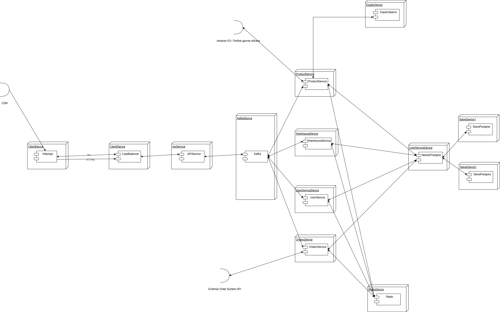
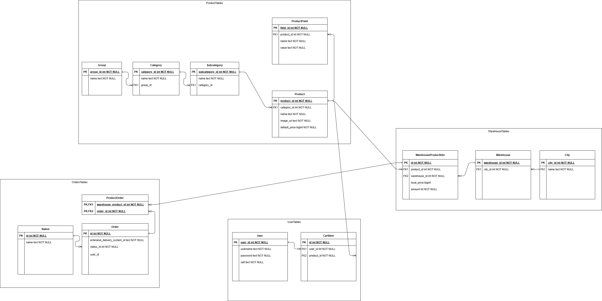

Стек технологий
1. Laravel (Лучше Symfony, но не знаком)
2. PostgreSQL (Реляционная бд)
3. ElasticSearch (Полнотекстовый поиск)
4. AmazonS3 (Хранение медиаконтента)
5. Apache Kafka (Для общения между микросервисами)
6. Redi для кеширования запросов.

Обоснование:
1. PostgreSQL - стандартное решение, поддержка реплицирования, ACID. Используем мастер для записи и slave для чтения данных. Но при увеличении нагрузки на запись будет проседать по производительности.
2. Amazon S3 - облачное хранилище. Быстрая, проще чем имплементировать своё хранение, но придется платить за использование
3. ElasticSearch - стандартное решение для поиска по тексту.
4. Laravel - огромный инструментарий для написания веб сервисов. Простота разработки.
5. Kafka - был выбор между RabbitMQ и Kafka, но Kafka лучше масштабируется. Но труднее разработка.
6. Redis - кеширование запросов.

Диаграмма развертывания:

Микросервисная архитектура обеспечивает горизонтальное скалирование сервисов. Сервис API является входной точкой для взаимодействия веб приложений и системой. Реквесты через HTTP, пуш ответа через websocket. API посылает сообщения в соответствующие топики, на основании этих сообщений микросервисы выполняют те или иные действия. Базы данных реплицируются: master используется для записи, slave для чтения.

ERD:

Текущие проблемы:
Несмотря на то, что данные о товарах обновляются не часто, нагрузка на запись все-равно может быть высокой. Эту нагрузку могут создать пользователи путем заказа товаров. Первоначально эту проблему можно решить путем включения мультимастера. Но в конечном итоге, полным решением этой проблемы будет дальнейшее распиливание базы данных на отдельные (потаблично) и переход к NoSql базам данных. Данное решение в свою очередь создаст проблему констистентности данных. Решением данной проблемы является переход к Event-Sourcing-у, выделением требований, для которых конечная констистенстность будет достаточной. Конечно, разработка подобных систем очень трудна.
Можно еще прикрутить ELK.